# Description of the research

The purpose of this research is to understand users' permissions in GitLab.  
How members could interact with the project and project variables.  
Can they get access to the values of the protected variables in job logs or not - that's the question.


## Let's have some preparation

For this research we will use:
 - Local installation of the GitLab server and GitLab Runner
 - Example Group
 - Example Project
 - Users with the different permissions on example project

**Please welcome! The dream team!**

### Agneska the otter
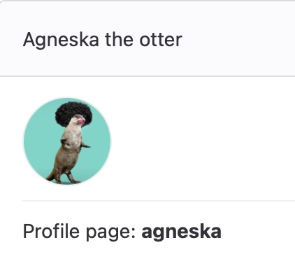

The `maintainer` of the Example Project.

### Jadviga the raccoon
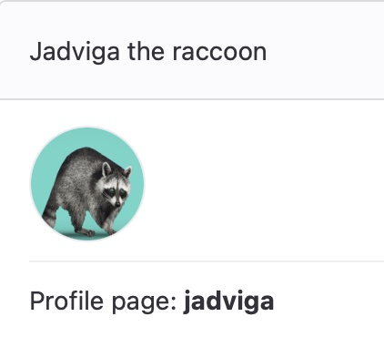

The `reporter` of the Example Project.

### Psemislaw the wagtail
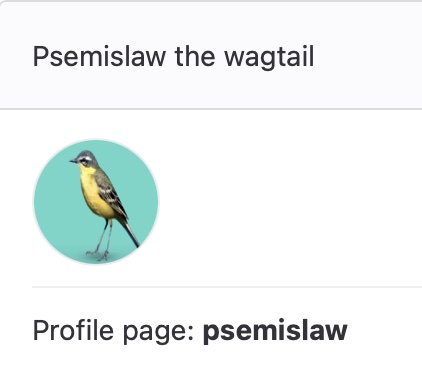

The `developer` of the Example Project.

### Wojciech the crab
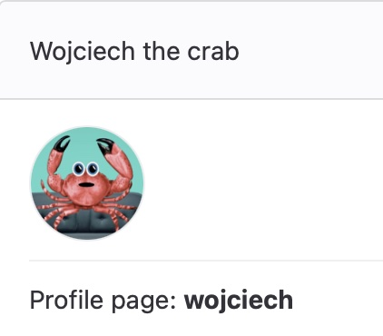

The `owner` of the Example Project and GitLab administrator.


## Let's start

First of all, let's check the accessibility of the settings of the project.

&#9746; Jadviga has no access to project `Settings`.  
&#9746; Psemislaw has no access to project `Settings`.  
&#9745; Agneska has access to project `Settings`.  
&#9745; Wojciech has access to project `Settings`.  

Users who have no access to the project settings can't view, create, edit and add variables.  
Users who have privileges higher than `mainteiner` can view (even protected), create, edit and add variables.  

Let's create two variables: a protected and an unprotected one.  
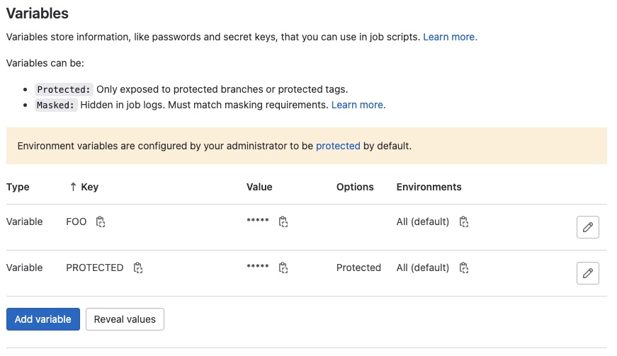

## Let's play with merge requests

### Jadviga
  - &#9746; Has no permission to push to the repository.

```
remote: You are not allowed to push code to this project.
fatal: unable to access 'http://gitlab.example.com/example-team1/example-project.git/': The requested URL returned error: 403
```

### Psemislaw
  - &#9745; Has permission to push to the repository.
  - &#9746; Has no permission to merge merge-request.
  - &#9745; Can get access to the value of the unprotected variable.
  - &#9746; Can not get access to the value of the protected variable.

```
$ echo $FOO
Բարեւ Ձեզ!
$ echo $PROTECTED
$PROTECTED
Job succeeded
```
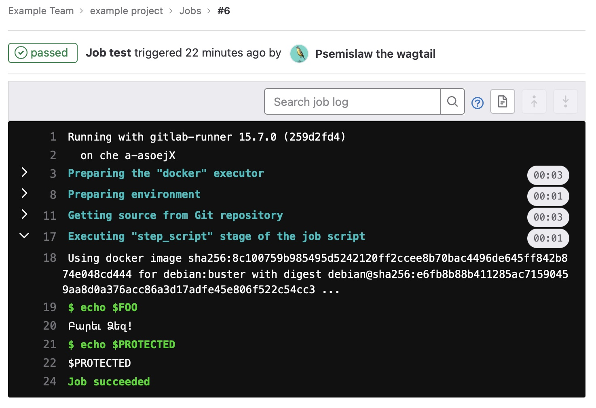

### Agneska
  - &#9745; Has access to the projects settings
  - &#9745; Has permission to push to the repository.
  - &#9745; Has permission to merge merge-request.
  - &#9745; Can get access to the value of the unprotected variable.
  - &#9746; Can not get access to the value of the protected variable.

```
$ echo $FOO
Բարեւ Ձեզ!
$ echo "Hi folks! My name is Agneska, I'm the maintainer of this project and I want to see the value of the super secret variable!"
Hi folks! My name is Agneska, I'm the maintainer of this project and I want to see the value of the super secret variable!
$ echo $PROTECTED
$PROTECTED
Job succeeded
```
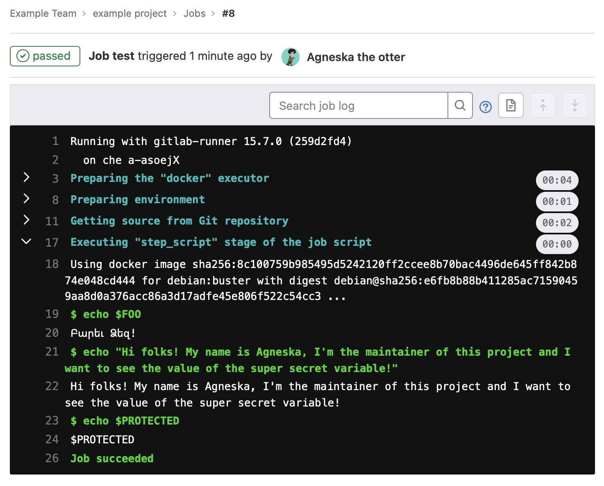

### Wojciech
  - &#9745; Has access to the projects settings
  - &#9745; Has permission to push to the repository.
  - &#9745; Has permission to merge merge-request.
  - &#9745; Can get access to the value of the unprotected variable.
  - &#9746; Can not get access to the value of the protected variable.

```
$ echo $FOO
Բարեւ Ձեզ!
$ echo "Hi folks! My name is Wojciech, I'm the owner of this project and administrator of the entire GitLab! I want to see the value of the super secret variable!"
Hi folks! My name is Wojciech, I'm the owner of this project and administrator of the entire GitLab! I want to see the value of the super secret variable!
$ echo $PROTECTED
$PROTECTED
Job succeeded
```
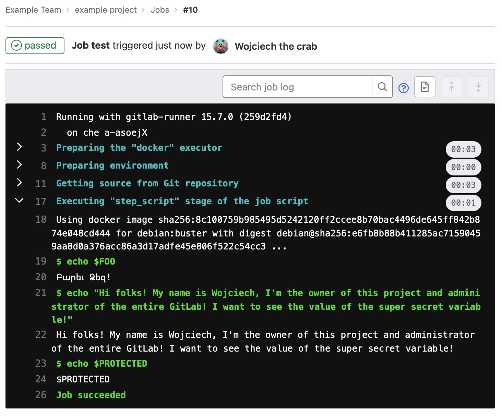

Let's continue with the Psemislaw, create a masked variable and try to get its value.
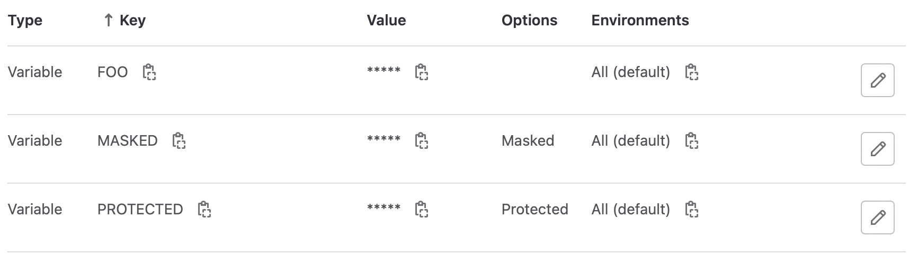

```
$ echo "Hi folks! My name is Psemislaw, and I'm going to try to get the value of the masked variable in the job logs."
Hi folks! My name is Psemislaw, and I'm going to try to get the value of the masked variable in the job logs.
$ echo $MASKED
[MASKED]
Job succeeded
```
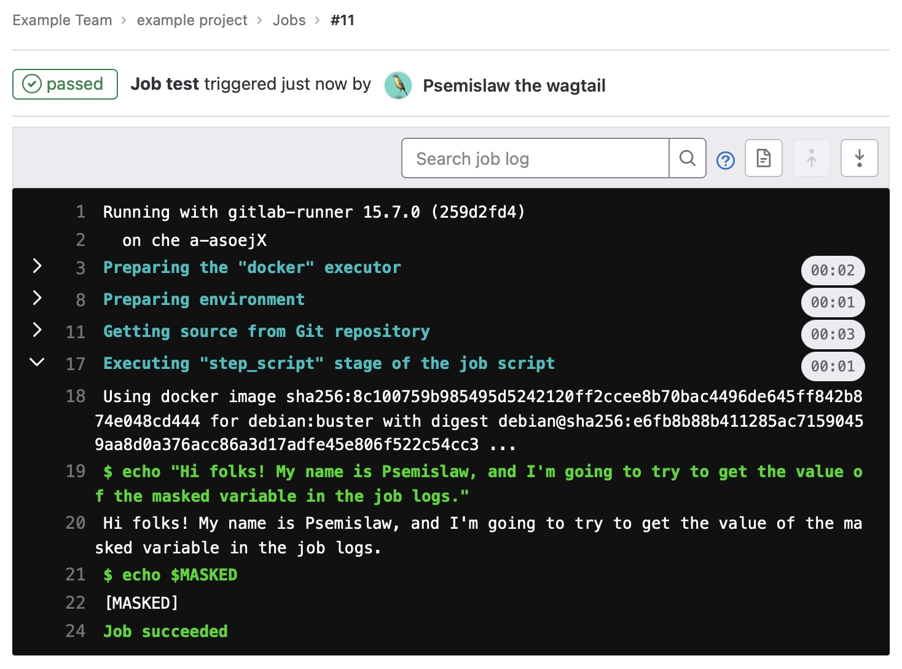


## Some difficulties
The problem is that for the masking variable, its value must correspond with the [masking requirements](https://docs.gitlab.com/ee/ci/variables/#mask-a-cicd-variable).

The value of the variable must:
  - Be a single line.
  - Be 8 characters or longer, consisting only of:
    - Characters from the Base64 alphabet (RFC4648).
    - The @, :, ., or ~ characters.
  - Not match the name of an existing predefined or custom CI/CD variable.

So the value can't be like this:
```
{
  "type": "",
  "project_id": "",
  "private_key_id": "",
  "private_key": "",
  "client_email": "",
  "client_id": "",
  "auth_uri": "",
  "token_uri": "",
  "auth_provider_x509_cert_url": "",
  "client_x509_cert_url": ""
}
```
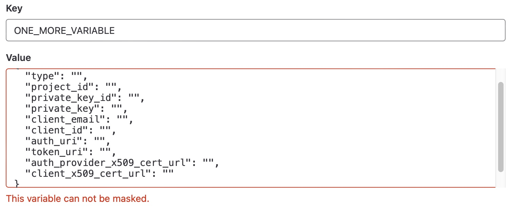

### Tips and tricks
What we can do in such a situation?  
Right, we can use `base64`!

```
 echo -n "{
  "type": "",
  "project_id": "",
  "private_key_id": "",
  "private_key": "",
  "client_email": "",
  "client_id": "",
  "auth_uri": "",
  "token_uri": "",
  "auth_provider_x509_cert_url": "",
  "client_x509_cert_url": ""
}
" | base64
ewogIHR5cGU6ICwKICBwcm9qZWN0X2lkOiAsCiAgcHJpdmF0ZV9rZXlfaWQ6ICwKICBwcml2YXRlX2tleTogLAogIGNsaWVudF9lbWFpbDogLAogIGNsaWVudF9pZDogLAogIGF1dGhfdXJpOiAsCiAgdG9rZW5fdXJpOiAsCiAgYXV0aF9wcm92aWRlcl94NTA5X2NlcnRfdXJsOiAsCiAgY2xpZW50X3g1MDlfY2VydF91cmw6IAp9Cg==
```
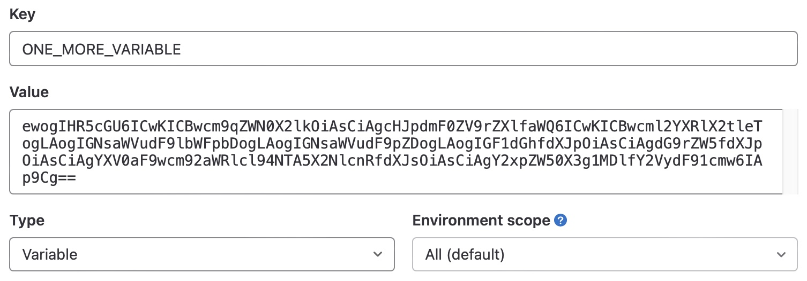

### Final check
Finally, let's check that Psemislaw can't get access to the value of this masked variable.  
And he can... That's just awful!
```
$ echo "Hi folks! My name is Psemislaw, and I'm going to try to get the value of the one more masked variable in the job logs."
Hi folks! My name is Psemislaw, and I'm going to try to get the value of the one more masked variable in the job logs.
$ echo $ONE_MORE_VARIABLE | base64 -d
{
  type: ,
  project_id: ,
  private_key_id: ,
  private_key: ,
  client_email: ,
  client_id: ,
  auth_uri: ,
  token_uri: ,
  auth_provider_x509_cert_url: ,
  client_x509_cert_url: 
}
Job succeeded
```
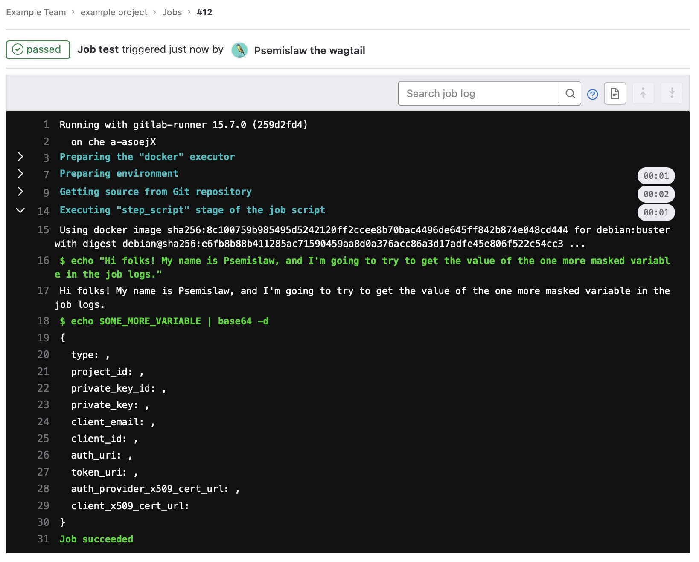

The magic is that Psemislaw can not access the variable's encrypted value, but he can access the decrypted part because it is not masked :man-shrugging:
```
$ echo "Hi folks! My name is Psemislaw, and I'm going to try to get the value of the one more masked variable in the job logs."
Hi folks! My name is Psemislaw, and I'm going to try to get the value of the one more masked variable in the job logs.
$ echo $ONE_MORE_VARIABLE
[MASKED]
$ echo $ONE_MORE_VARIABLE | base64 -d
{
  type: ,
  project_id: ,
  private_key_id: ,
  private_key: ,
  client_email: ,
  client_id: ,
  auth_uri: ,
  token_uri: ,
  auth_provider_x509_cert_url: ,
  client_x509_cert_url: 
}
Job succeeded
```
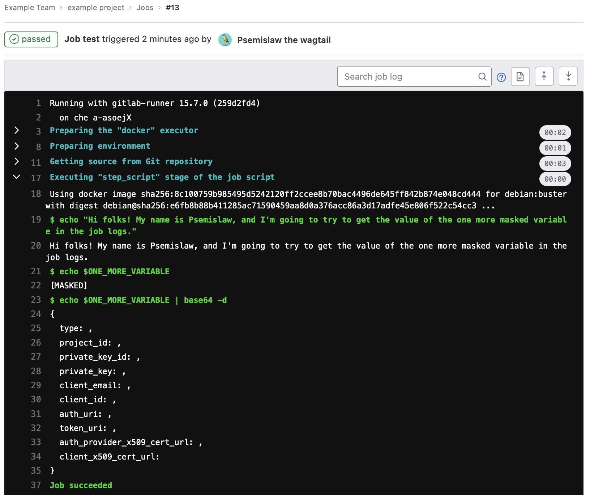

# Conclusion

In conclusion, I want to say that I wasted a lot of my time on this useless report.  
All I can say is always use protected variables if you don't want their values would be stolen.  
Be attentive.   
Take care of yourself and your family.  
God Save The King!